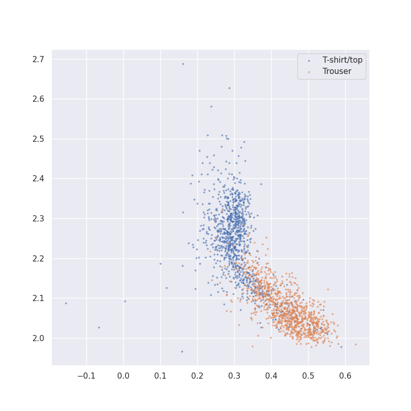
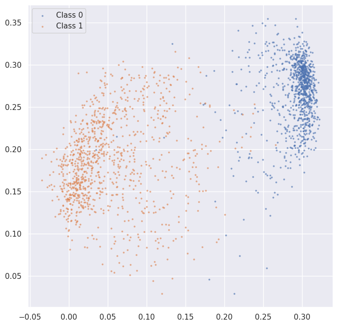

# README

## Joint Embedding and Training Implementation

This repository contains code for implementing joint embedding techniques using contrastive learning and Variance-Invariance-Covariance Regularization (VICReg). The training pipeline leverages these techniques to enhance feature representation in machine learning models.

### Table of Contents
- [Requirements](#requirements)
- [Code Explanation](#code-explanation)
  - [Contrastive Loss](#contrastive-loss)
  - [Variance Loss](#variance-loss)
  - [Covariance Loss](#covariance-loss)
  - [Sample Contrastive Pairs](#sample-contrastive-pairs)
- [Test](#test)
- [References](#references)

### Requirements

```shell
pip install -r requirements
```

### Code Explanation parts

#### Contrastive Loss

The `contrastive_loss` function computes the contrastive loss between the actual, positive, and negative samples.

#### Variance Loss

The `std_loss` function computes the variance loss to ensure that the variance of the embeddings remains close to 1.

#### Covariance Loss

The `cov_loss` function computes the covariance loss to ensure that the covariance matrix of the embeddings is close to the identity matrix.

#### Sample Contrastive Pairs

The `sample_contrastive_pairs_SL` function generates positive and negative pairs for contrastive learning.

### Test

We are testing the implementation using the FashionMNIST dataset. The FashionMNIST dataset is a popular benchmarking dataset for machine learning algorithms, consisting of grayscale images of fashion items.

#### Results of this approach on a simple data with a simple model

I used fashonMinist dataset for testing and small model for embedding.

- 
- 
- 

### References

- [VICReg: Variance-Invariance-Covariance Regularization](https://github.com/AnnaManasyan/VICReg)
- [Barlow Twins](https://github.com/facebookresearch/barlowtwins/tree/a655214c76c97d0150277b85d16e69328ea52fd9)
