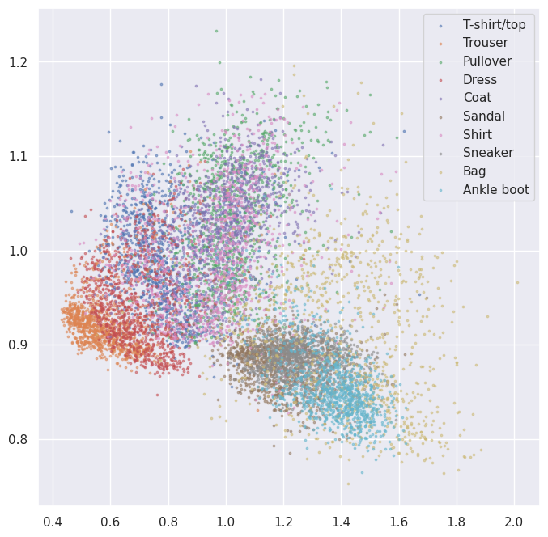

# README

## Testing Joint Embedding approach with simple data

We are testing the implementation using the FashionMNIST dataset. The FashionMNIST dataset is a popular benchmarking dataset for machine learning algorithms, consisting of grayscale images of fashion items.

### Results of this approach on a simple data with a simple model

I used fashonMinist dataset for testing and small model for embedding.

- 
- 
- 