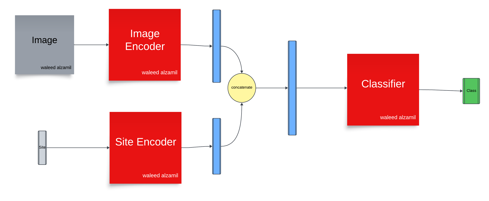

# Model Conditioned by the Site - First Approach

## Overview

This repository implements a neural network model that combines **image data** and **site information** to perform classification tasks. The model architecture is modular, consisting of three main components: `ImageEncoder`, `SiteEncoder`, and the `Classifier`. These components work together to process input data and generate classification outputs. The repository is designed to allow easy experimentation and testing of various neural network architectures, especially for multi-site image classification tasks.

## Table of Contents
- [Model Architecture](#model-architecture)
  - [Conditioning on the Site](#conditioning-on-the-site)
  - [ImageEncoder](#imageencoder)
  - [SiteEncoder](#siteencoder)
  - [Classifier](#classifier)
- [Data Flow](#data-flow)
- [Repository Structure](#repository-structure)
- [Installation](#installation)
- [Usage](#usage)
  - [Training](#training)
  - [Testing](#testing)
  - [Visualizing Metrics](#visualizing-metrics)
- [Future Work](#future-work)
- [Contributing](#contributing)
- [License](#license)

---

## Model Architecture

### Conditioning on the Site

The model is conditioned by the site using a two-step process:

1. **First Approach (Implemented here):**  
     
   This approach combines the image encoding and site encoding by concatenating the two representations.

2. **Second Approach (Not Tested):**  
     
   The second approach is still under development and testing.

---

### ImageEncoder

The `ImageEncoder` processes the input images through several convolutional and pooling layers, extracting relevant image features. These features are later used by the classifier in combination with site information.

### SiteEncoder

The `SiteEncoder` uses an embedding layer to process site data, followed by a fully connected layer. The embedding helps represent the site information in a way that can be used effectively for classification.

### Classifier

The `Classifier` combines both image and site features and passes them through fully connected layers to produce the final classification output.

---

## Data Flow

The data flow within the model follows these steps:

1. **Images** are passed through the `ImageEncoder`, producing `img_encoded`.
2. **Sites** are passed through the `SiteEncoder`, producing `site_encoded`.
3. Both `img_encoded` and `site_encoded` are concatenated to form the `combined` representation.
4. The `combined` representation is fed into the `Classifier`, which outputs the final classification prediction.

---

## Repository Structure

The repository is organized as follows:

```
/DRP-dev
│
├── Density_Estimation/         # (Subfolder for Density Estimation models or experiments)
├── Joint_Embedding/            # (Subfolder for Joint Embedding models or experiments)
├── Supervised_fashion/         # (Folder dedicated to Supervised Learning approaches)
│   ├── First_approach/
│   │   ├── helpful/
│   │   │   ├── Analysis.py         # Tools for data and results analysis
│   │   │   ├── check.py            # Validation scripts
│   │   │   ├── combine.py          # Combining or merging data/outputs
│   │   │   ├── helpful.py          # Miscellaneous helper functions
│   │   │   ├── preprocessing.py    # Data preprocessing routines
│   │   │   ├── split.py            # Data splitting functionality
│   │   │   └── vis_metrics.py      # Visualization of training metrics
│   │   ├── base_model.py           # Base class for model definition and device management
│   │   ├── config.py               # Configuration file (hyperparameters and paths)
│   │   ├── Dataset.py              # Custom dataset loading and preprocessing
│   │   ├── EESmodel.py             # Model architecture (Extended Embedding)
│   │   ├── MSmodel.py              # Model for multi-site tasks
│   │   ├── SEmodel.py              # Model for supervised learning with site embeddings
│   │   ├── Tmodel.py               # Task-specific model architecture
│   │   ├── transformations.py      # Image transformations/augmentations
│   │   ├── train.py                # Training pipeline
│   │   ├── main.py                 # Main script for running training/evaluation
│   │   └── README.md               # Documentation file
│
└── .gitignore                    # Git ignore configuration
```

---

## Future Work

- Implement the **Second Approach** for site conditioning.
- Experiment with **pretrained models** such as InceptionResNet, GoogLeNet, or Vision Transformers (ViT).
- Apply **joint embedding methods** (in progress).
- Explore **regularization** and other advanced architectural techniques for further improvements.

---