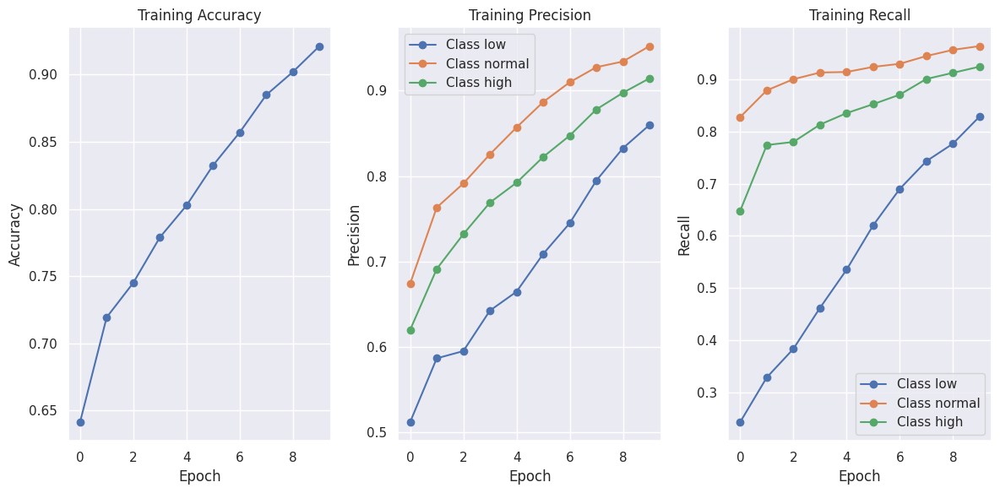
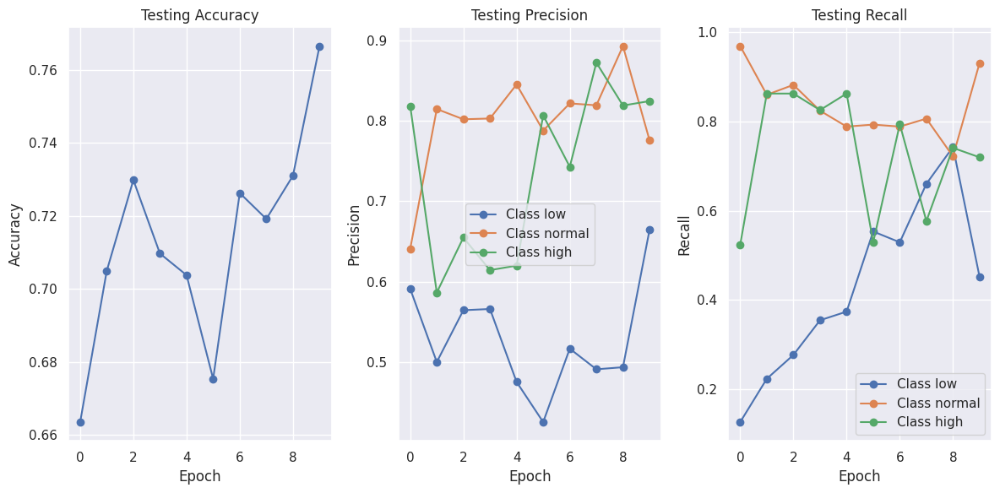
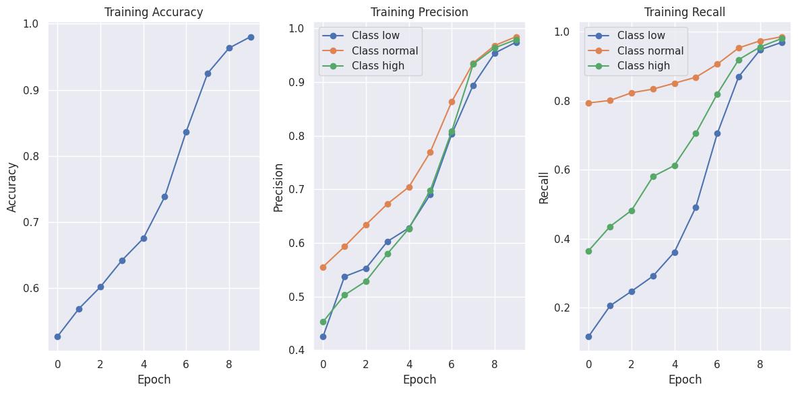
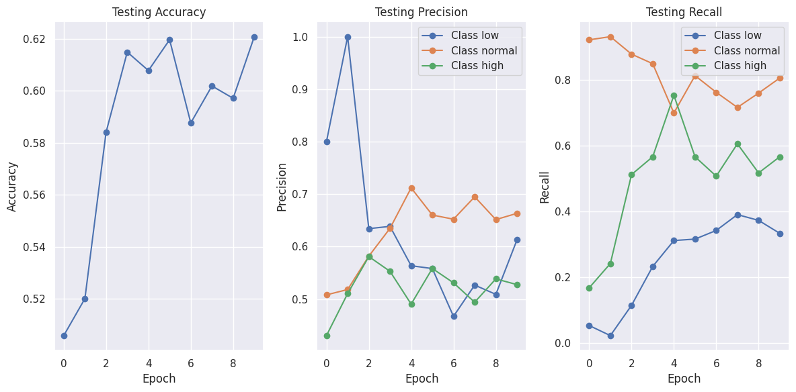

# Model conditioned by the site First Approach:

## Overview

This repository implements a neural network model that combines image data and site information to perform classification tasks. The model is composed of three main components: the `ImageEncoder`, the `SiteEncoder`, and the `Classifier`. These components work together to process the input data and produce classification outputs.

## Model Architecture

### ImageEncoder
The `ImageEncoder` processes image data through a series of convolutional and pooling layers, followed by a fully connected layer. This encoder extracts features from the images which are then used for classification.

### SiteEncoder
The `SiteEncoder` processes site information using an embedding layer followed by a fully connected layer. This encoder extracts features from the site data which are then used for classification.

### Classifier
The `Classifier` combines the features extracted by the `ImageEncoder` and `SiteEncoder` and processes them through fully connected layers to produce the final classification output.

## Data Flow

The data flow in the model can be summarized as follows:

1. **Images** are input to the `ImageEncoder` which outputs `img_encoded`.
2. **Sites** are input to the `SiteEncoder` which outputs `site_encoded`.
3. `img_encoded` and `site_encoded` are concatenated to form the `combined` input.
4. The `combined` input is passed to the `Classifier` which produces the final `outputs`.

## Results
- I trained the model from scratch no pretraned models used.
- After training for `15` epoch we noticed that `10` epochs is more than enough and after that no training.
- `83 M` -`55 M` for inception base model- parameter in the whole Network.
- Adam optimizer are used with `leaning rate 0.001`, `batch size = 64`, `embedding dimentions for the site = 64` (found that 32 is enough)
- with Inception base model:
    - Got on seen data `accuracy` > 0.95, `precesion (average)` > 0.9 and `recall (average)` > 0.9 
    - Got on unseen data `accuracy` > 0.8 , `precesion (average)` > 0.9 and `recall (average)` > 0.9 
- with traditional linear base model:
    - Got on seen data `accuracy` > 0.99, `precesion (average)` > 0.99 and `recall (average)` > 0.99 
    - Got on unseen data `accuracy` > 0.62, `precesion (average)` > 0.6 and `recall (average)` > 0.56 

## Future work
- try the samething with pretrained models like InceptionResNet or google net or ViT (attention-based models) (Done)
- Joint Embedding methods. (Upworking)
- Regularization and Architectural methods.