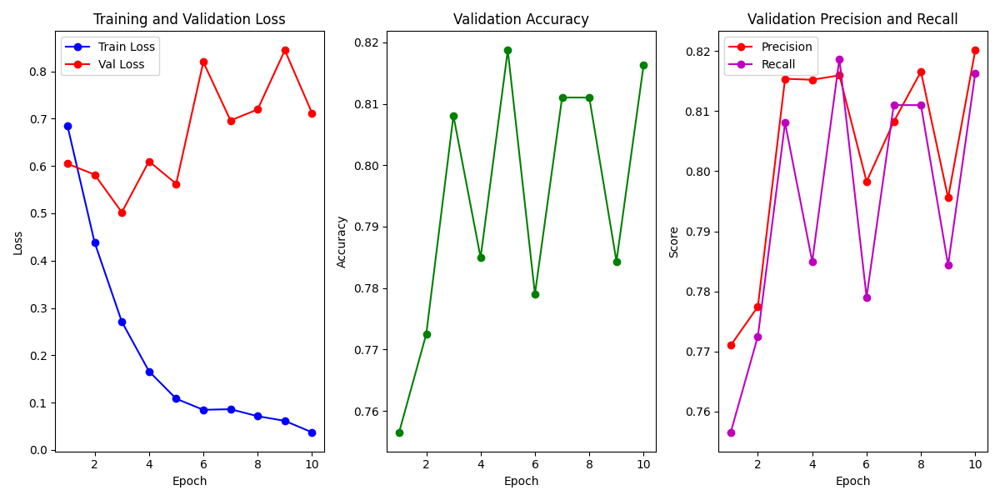
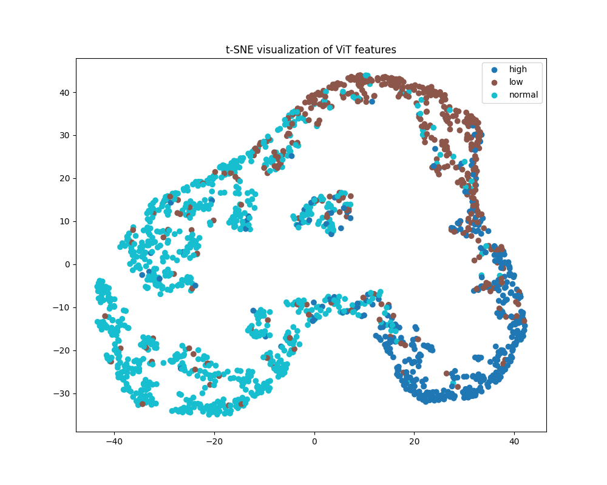

# VIT MODEL Approach

## Overview

In this project, we develop a custom image classification model using a Vision Transformer (ViT) architecture. The model is trained from scratch without leveraging pre-trained weights from other sources. The primary objective is to evaluate the model's performance on a dataset consisting of multiple classes with varying image categories.

## Model Architecture

The model utilizes the Vision Transformer (ViT) architecture, specifically the `google/vit-base-patch16-224-in21k`. This model employs a transformer-based approach tailored for image classification tasks. 

Key architectural details include:
- **Number of Layers:** 12 transformer layers (encoder blocks)
- **Hidden Units per Layer:** 768
- **Attention Heads:** 16

This architecture allows the model to capture complex patterns in image data through self-attention mechanisms.

## Training and Evaluation

### Training Details
- **Training Method:** Trained from scratch with no pre-trained models used
- **Epochs:** 10
- **Optimizer:** Adam
- **Learning Rate:** 0.001
- **Batch Size:** 32

### Results
- **Parameters:** The model comprises approximately 85 million parameters.
- **On Seen Data:(80% from the size of total data)** Achieved an accuracy greater than 0.9
- **On Unseen Data:(20% from the size of total data)** 
  - Accuracy: 0.81
  - Precision: 0.81
  - Recall: 0.81

The performance metrics indicate that the model performs well on both seen and unseen data, demonstrating its robustness and generalization capability.

Result for testing dataset :

- 
- 
